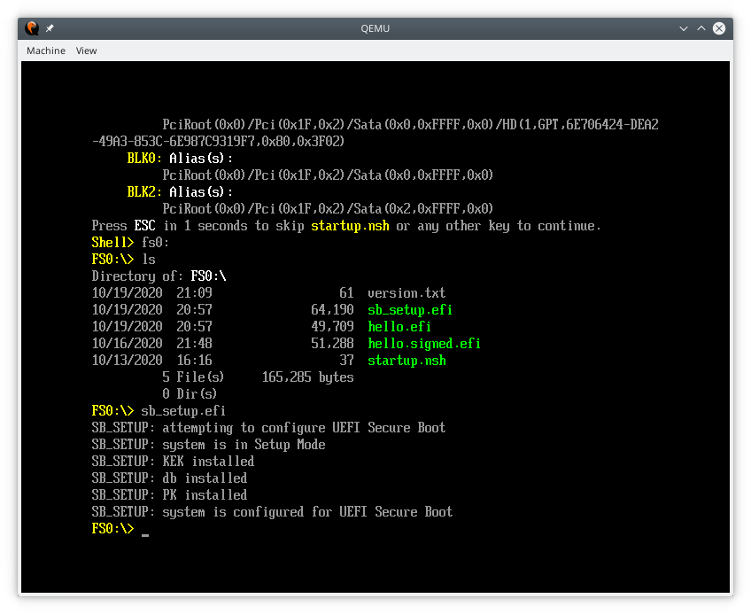

QEMU UEFI Secure Boot Development Environment
===============================================================================
Contact: pmoore2@cisco.com or paul@paul-moore.com

This repository provides a UEFI Secure Boot development environment based on
QEMU, OVMF, and the libtpms/swtpm TPM emulator.  Links to all of these
projects can be found below, but some Linux distributions may already provide
packages for each of the projects.

 * https://www.qemu.org
 * https://github.com/tianocore/edk2/tree/master/OvmfPkg
 * https://github.com/stefanberger/libtpms
 * https://github.com/stefanberger/swtpm

The efitools tool suite and and guestfish tool are also used to create and
package the UEFI Secure Boot variables as well as dynamically create disks for
testing, but neither is part of the UEFI Secure Boot chain.

 * https://git.kernel.org/pub/scm/linux/kernel/git/jejb/efitools.git
 * https://libguestfs.org/guestfish.1.html

## How The Development Environment Works

*NOTE: this README is still a bit crude, but it should get you started.*

The tools in this repo automate a number of tasks intended to make it easier
for developers to test EFI applications in a virtual UEFI Secure Boot
environment.  Beyond simply running a QEMU instance with OVMF Secure Boot and
emulated TPM support, the Makefiles in this repo also generate all of the
necessary keys/certificates and configuration tools to configure the virtual
environment for UEFI Secure Boot.

Normal usage is to simply run `make qemu-esp` or `make qemu-full`.  In both
cases a small disk is created with a single FAT filesystem that contains
a tool, `sb_setup.efi`, which configures UEFI Secure Boot with random PK
and KEK certificates and the Microsoft UEFI CA from 2011 loaded into the db
variable.  Additional certificates can be added to the db variable (see below),
and any files placed in the "fs_esp/" directory will be copied to this FAT
filesystem.



The included Microsoft UEFI CA should be sufficient to install and run many
stock Linux distributions that support UEFI Secure Boot.  In order to install
a Linux distribution you will need to create raw disk image in the project's
base directory named "drive_qemu.img" and place a copy of the installer ISO
in the project's base directory named "distro.iso".  With these disk images in
place you can run `make qemu-full` to start QEMU with the disk images attached.

In order to make it easier to transfer files to and from an installed Linux
system, the "fs_virtfs/" directory is exported as a Plan 9 filesystem in the guest
using the "virtfs0" mount tag.

Build time configuration can be found in the "make.conf" file in the project's
base directory.

## Adding UEFI Keys/Certificates

One of the primary reasons for this project is to make it easier to test UEFI
Secure Boot applications such as bootloaders.  This requires the ability to add
arbitrary certificates to the UEFI db variable.  In order to add new
certificates to the UEFI db, simply copy the PEM encoded certificate and
associated text file with the certificate's GUID into the "keys/DB-extra"
directory.  Both files should follow the "DB-xxx.{pem,guid}" naming convention.
Multiple certificates can be added to the db variable by adding them to this
directory.

Here is an example of adding a "DB-test" certificate to the "keys/DB-extra"
directory:

```
% ls -l keys/DB-extra/DB-*
-rw-r--r-- 1 user users   37 Oct 19 13:24 DB-test.guid
-r--r--r-- 1 user users 1.7K Oct 19 13:24 DB-test.key
-r--r--r-- 1 user users 1.2K Oct 19 15:30 DB-test.pem
% cat keys/DB-extra/DB-test.guid
e5c4bc7b-9cc8-4df9-9420-c86e64a7b495
```

Once the certificates and GUID files have been placed in this directory, they
will be included in any future `sb_setup.efi` builds.  If you have already
configured the virtual environment for secure boot, you may need to "reset" the
system before you can load new certificates into the db.  You can do this by
deleting the "ovmf_vars.fd" file from the project's base directory, it will be
recreated the next time you start QEMU.

## Adding UEFI Test Applications

Any files, including UEFI applications, placed in the "fs_esp/" directory will
be copied into the dedicated FAT filesystem/disk attached to QEMU.  The disk
will be sized as needed to fit all of the files.

Signing EFI binaries is beyond the scope of the tools presented here, but there
are two projects that offer tools to sign EFI binaries in such a way that they
are suitable for UEFI Secure Boot:

 * https://git.kernel.org/pub/scm/linux/kernel/git/jejb/sbsigntools.git
 * https://github.com/rhboot/pesign

## Acknowledgements

A special thanks to the READMEs, project documentation, and blog posts below
as they were very helpful in creating the tools in this repository.

 * https://github.com/tianocore/edk2/blob/master/OvmfPkg/README
 * https://git.kernel.org/pub/scm/linux/kernel/git/jejb/efitools.git/tree/README
 * https://en.opensuse.org/openSUSE:UEFI_Secure_boot_using_qemu-kvm
 * https://en.opensuse.org/openSUSE:UEFI_Image_File_Sign_Tools
 * https://www.labbott.name/blog/2016/09/15/secure-ish-boot-with-qemu
